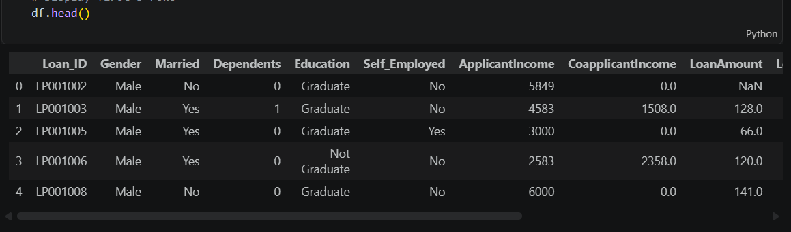
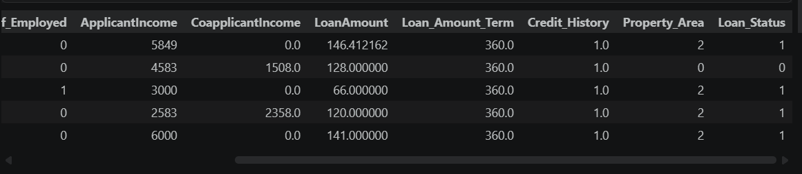
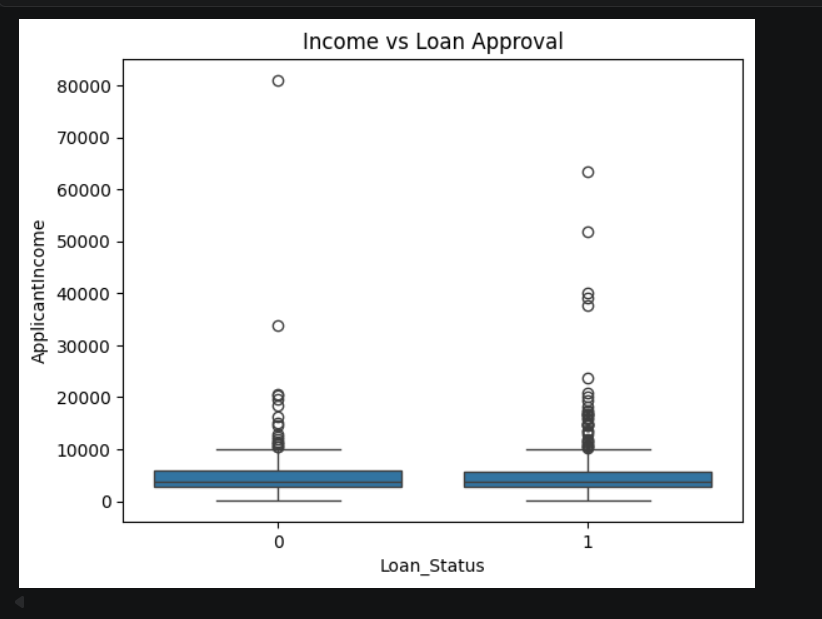
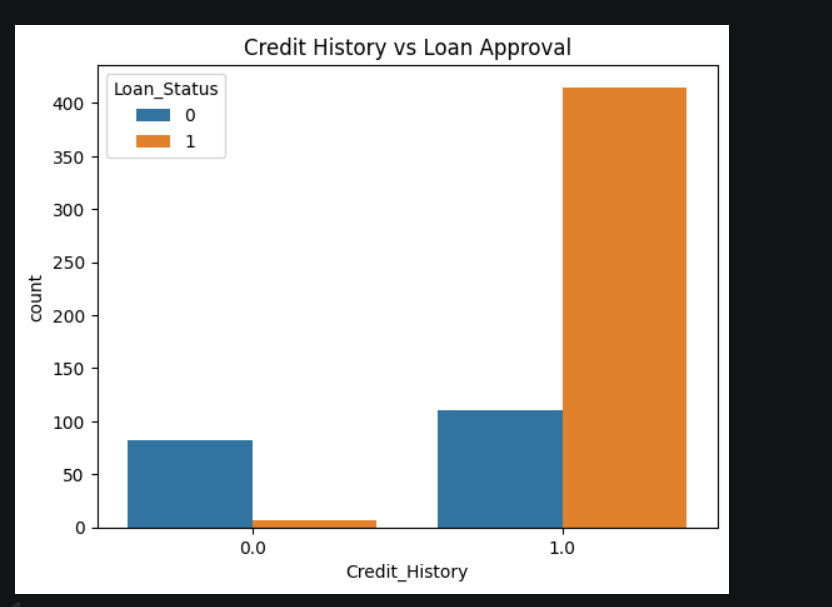
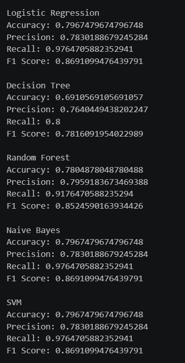
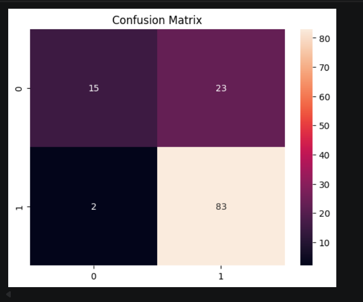
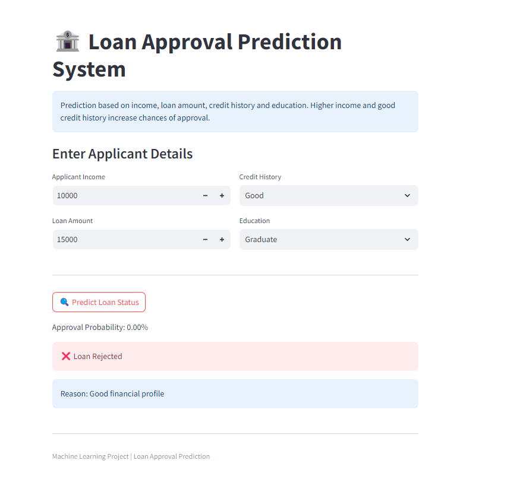
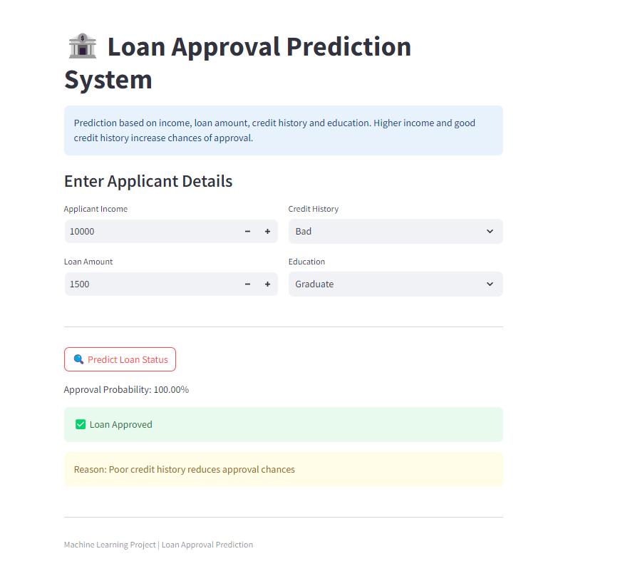

# Loan Approval Prediction System

## Project Overview
The Loan Approval Prediction System is a Machine Learning-based application that predicts whether a loan application should be approved or rejected based on applicant details such as income, loan amount, credit history, and education.

This system helps automate loan decision-making, reduce risk, and improve efficiency in financial institutions.

---

## Objective
- Predict loan approval status (Approved / Rejected)
- Reduce manual decision-making errors
- Speed up loan processing
- Assist banks in risk assessment

---

## Problem Statement
Traditional loan approval systems:
- Are time-consuming
- May involve human bias
- Lack consistency in decision-making

This project uses Machine Learning to automate and improve the accuracy of loan approval decisions.

---

## Proposed Solution
The system:
- Takes applicant details as input
- Processes and analyzes the data
- Uses ML models to predict:
  - ✅ Loan Approved
  - ❌ Loan Rejected

---

## Technologies Used
- **Programming Language:** Python
- **Libraries:**
  - Pandas
  - NumPy
  - Scikit-learn
  - Matplotlib
  - Seaborn
  - Streamlit
- **Tools:**
  - Jupyter Notebook
  - VS Code

---

## Dataset Description
The dataset includes features like:

| Feature | Description |
|--------|------------|
| ApplicantIncome | Applicant's income |
| LoanAmount | Loan amount |
| Credit_History | Credit score (0/1) |
| Education | Graduate / Not Graduate |
| Loan_Status | Target variable |

---

## Methodology

### 1. Data Collection
- Kaggle dataset
- CSV file

### 2. Data Preprocessing
- Handling missing values
- Encoding categorical variables
- Normalization of data

### 3. Exploratory Data Analysis (EDA)
- Income vs Loan Approval
- Credit History vs Approval
- Data visualization using graphs

### 4. Feature Selection
Selected important features:
- Applicant Income
- Loan Amount
- Credit History
- Education

### 5. Model Selection
Multiple ML models were used:
- Logistic Regression
- Decision Tree
- Random Forest
- Naive Bayes
- Support Vector Machine (SVM)

### 6. Model Training
- Train-test split (80:20)
- Models trained on training data

### 7. Prediction
- Input: Applicant details
- Output: Loan Approved / Rejected

### 8. Model Evaluation
Metrics used:
- Accuracy
- Precision
- Recall
- F1 Score
- Confusion Matrix

---

## Best Model
- **Model Used:** Logistic Regression  
- **Accuracy:** 82%

---

## Web Application
A Streamlit-based web application was developed where users can:
- Enter applicant details
- Get real-time loan approval prediction
- View prediction probability and explanation

---

## Output Screenshots

### Dataset Preview

### Data Preprocessing

### Income vs Loan Approval

### Credit History vs Loan Approval

### Model Performance

### Confusion Matrix

### Loan Rejected Output

### Loan Approved Output

These outputs demonstrate how the system analyzes applicant details and predicts loan approval status using machine learning models.

---

## Live Demo
    https://loan-approval-prediction-varshini.streamlit.app

---

## Advantages
- Faster loan processing
- Reduces human bias
- Accurate predictions
- Scalable system

---

## Limitations
- Depends on data quality
- Cannot handle rare cases perfectly
- Requires model updates

---

## Future Enhancements
- Real-time loan approval system
- Integration with banking systems
- Deep learning models
- Credit score API integration

---

## Conclusion
The Loan Approval Prediction System automates loan decision-making using machine learning, improving efficiency, accuracy, and reliability in financial systems.

---

## How to Run
1. Install dependencies:
    pip install -r requirements.txt

2. Run the app:
    streamlit run app.py

---

## Author
**Varshini S**
